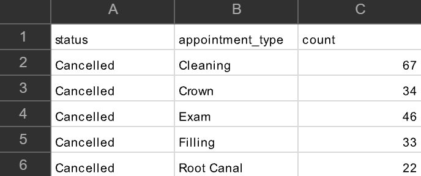

# dental_appointments_analysis-
Cleaning and analyzing a synthetic dental dataset using Google Sheets and SQL. 

Notice: This project uses a synthetic dataset for portfolio purposes only. The dataset contains no patient information or health records.

Tools Used:  
- Google Sheets
- SQL
- GitHub

Step 1: Data Cleaning
The raw dataset contained missing values and inconsistent category names. I identified missing appointment type and wait times. I addressed missing appointment type by deleting the affected rows since an appointment type cannot be reliably determined. Missing wait time was addressed by finding the average wait time of each appointment and using those averages to fill in the missing values. In addition, inconsistent insurance category names was fixed by using the UNIQUE function in Sheets in order to see the different types of insurances. Then, UPPER, LOWER, and PROPER functions were used to correct the categories. 

Step 2: Data Analysis
I investigated the number of cancellations for each appointment type, insurance type, and provider through SQL queries. I also calculated the no-show rate using the total amount of appointments. 

Step 3: Dashboard
   

Step 3: Key Findings
1. The appointment type with the highest number of cancellations was cleanings.   
  

2. Patients with PPO insurance had the highest number of cancellations among insurance categories.   

3. Provider C had the highest average patient wait time.  
  

4. Provider B had the highest number of cancellations among providers.   
  

